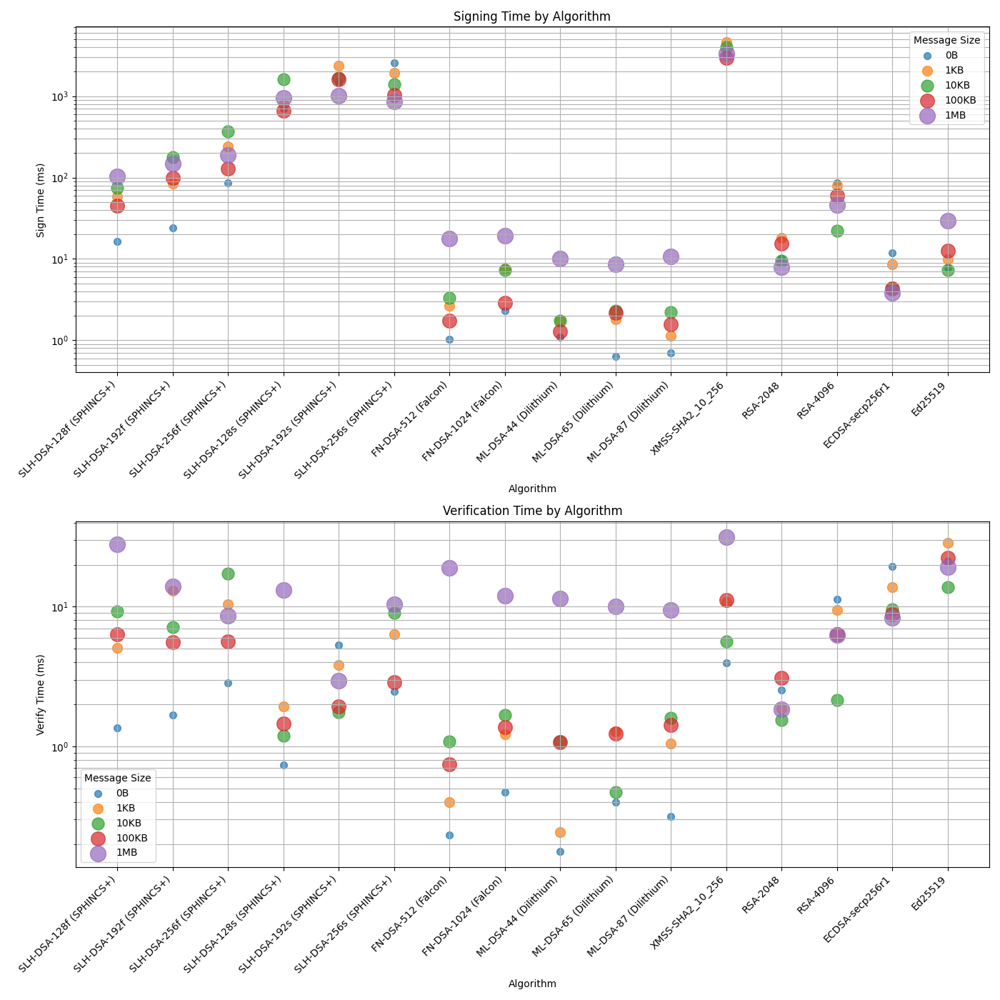

# PQC Algorithm Benchmarking Tool

This tool benchmarks post-quantum cryptographic (PQC) algorithms against classical algorithms, comparing key sizes, signature sizes, and performance metrics.

## Features

- Comparison of PQC and classical digital signature algorithms
- Key generation, signing, and verification timing
- Multiple message size tests (0B to 1MB)
- Performance graphs with logarithmic scale
- Command-line control of iterations

## Installation

1. Clone the repository:
```bash
git clone https://github.com/taswhe/pqc-benchmark.git
cd pqc-benchmark
```

2. Install system dependencies (Linux):
```bash
sudo apt update
sudo apt install git build-essential cmake libssl-dev python3-dev
```

3. Create and activate a virtual environment:
```bash
python3 -m venv venv
source venv/bin/activate
```

4. Install Python dependencies:
```bash
pip install -r requirements.txt
```

5. Build and install liboqs-python:
```bash
git clone https://github.com/open-quantum-safe/liboqs-python.git
cd liboqs-python
pip install .
cd ..
```

6. Build and install Botan 3 (for XMSS support):
```bash
git clone https://github.com/randombit/botan.git
cd botan

# Linux/WSL optimized build:
python3 configure.py --prefix=/usr/local --enable-module=xmss \
 --with-python-versions=3 --with-zlib --with-bzip2 \
 --cc=clang --cc-min-version=11.0 \
 --cxxflags="-O3 -march=native -flto" --ldflags="-flto" \
 --lto-cxxflags-to-ldflags --build-targets="shared,cli,tests"
 make -j$(nproc)
 sudo make install
'''

## Usage

Run the benchmarking tool:
```bash
python -m pqc_benchmark.main [-n ITERATIONS]
```

Options:
- `-n ITERATIONS`: Number of iterations to run for each benchmark (default: 10)

Example:
```bash
python -m pqc_benchmark.main -n 5
```

## Output

The tool will display:
1. Algorithm comparison table showing key sizes and signature sizes
2. Key generation times
3. Performance metrics for different message sizes
4. Two graphs saved as pqc_benchmark_results.png:
   - Signing Time by Algorithm
   - Verification Time by Algorithm

The graphs use:
- Algorithm names on the x-axis
- Logarithmic scale on the y-axis
- Different dot sizes for different message sizes
- Clear legends indicating message sizes

## Supported Algorithms

- PQC Algorithms:
  - SLH-DSA (SPHINCS+)
  - FN-DSA (Falcon)
  - ML-DSA (Dilithium)
  - XMSS (via Botan3)
- Classical Algorithms:
  - RSA
  - ECDSA
  - Ed25519

## Requirements

- Python 3.8+
- liboqs (built from source)
- See requirements.txt for Python dependencies

## License

MIT License

## Benchmark Results

View the latest benchmark results:
- [Full benchmark results](results/results.txt)
- Performance graph: 


Note: XMSS is supposed to be more efficient than SLH-DSA. However in our test, it isn't.
This could be because we are using Botan3 for XMSS and liboqs for SLH-DSA.
I am not sure if Botan3's XMSS is optimized or not. It might be focusing on correctness.
Given that XMSS has not been selected for FIPS, perhaps less attention was given to it.
